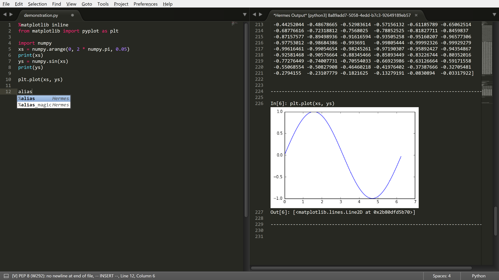

Hermes package for Sublime Text 3
===

Hermes is a package for Sublime Text 3, which provides in-editor code execution and autocomplete in interaction with Jupyter kernels.
The concept of an editor extension communicating Jupyter kernels is inspired by @nteract's splendid Atom package [Hydrogen](https://github.com/nteract/Hydrogen). However, I still love ST3 too so much that implements this package:)

Any feedback is highly welcome, though currently I don't have any stipulated policy to contribute.



Features
---------------

Currently it supports the actions below:

  - Connect to running Jupyter processes through HTTP.

    + The plugin can deal authorization by token.

  - Connect view to a Jupyter kernel. We can also start a kernel.
  - Execute code block in view and get the result within ST3.

    + A view to store inputs and results is created for each kernel.
    + Figures with "image/png" type and passed as a "display_data" message can be shown within result view.

  - Get completion from the connected Jupyter kernel.


Why using Jupyter?
-----------------

We can execute code, retrieve results including images, get completions and function signatures by the unified Jupyter protocol regardless of language if it has Jupyter kernel.
If we try to do that by directly running interpreters there should be several interpreter-specific problems, but we can entrust the kernel maintainers on language-specific problems by using Jupyter. 


Why not using Jupyter Notebook?
-----------------

I admit Jupyter Notebook is a powerful tool for instantly sharing small analysis work, exploring data or APIs, or making executable tutorials. Yes, I often use it, too.
However, in my opinion, it is not suited for projects with large code bases.
I want to jumpt across files instantly, make modules organized (not saved as `.ipynb`s), kick scripts with various parameters, and make project code more reusable and reproducible... but still I want to edit them with interactive feedback.


Installation
-----------------

Currently this package is not in the Package Control. You have to clone this repo. You can install by hitting command below at the Packages directory (can be opened by `Preferences` -> `Browse Packages...` menu.)

```shell
git clone https://github.com/ngr-t/SublimeHermes Hermes
```


Usage
-----------------

  0. (Outside of the editor) Start Jupyter notebook or create tunneling.
  1. Set url by `Hermes: Set URL` command (whose command name is `hermes_set_url`).
  2. Connect to kernel.

    - If no kernel is running, start a kernel by `Hermes: Start Kernel` (whose command name is `hermes_start_kernel`)
    - If kernel exists, correspond the view to the kernel by `Hermes: Connect Kernel` (whose command name is `hermes_connect_kernel`)

  3. Execute code by `Hermes: Execute Block` (whose command name is `hermes_execute_block`).

    - If there are selected regions, execute them.
    - If not, the adjacent lines with no empty line and not less indented than the line which includes the cursor are considered as the code block.

TODO
-----------------

  - [x] Consider other ways to extract code block from a view.

    - [x] Use selection.

  - [ ] Enable to handle `stdin_request`.
  - [x] Enable to toggle if completions are shown.
  - [ ] Moving cursor on execution.
  - [ ] Enable object inspection to be shown in panel and popup.
  - [ ] Implement output as inline Phantom like LightTable or Hydrogen.
  - [x] Function to stop a kernel.
  - [x] Function to restart a kernel.
  - [x] Function to interupt a kernel.
  - [x] Show the connected kernel in status bar.
  - [ ] Authentication.

    + [x] token
    + [ ] password

  - [x] Make introduction pictures.
